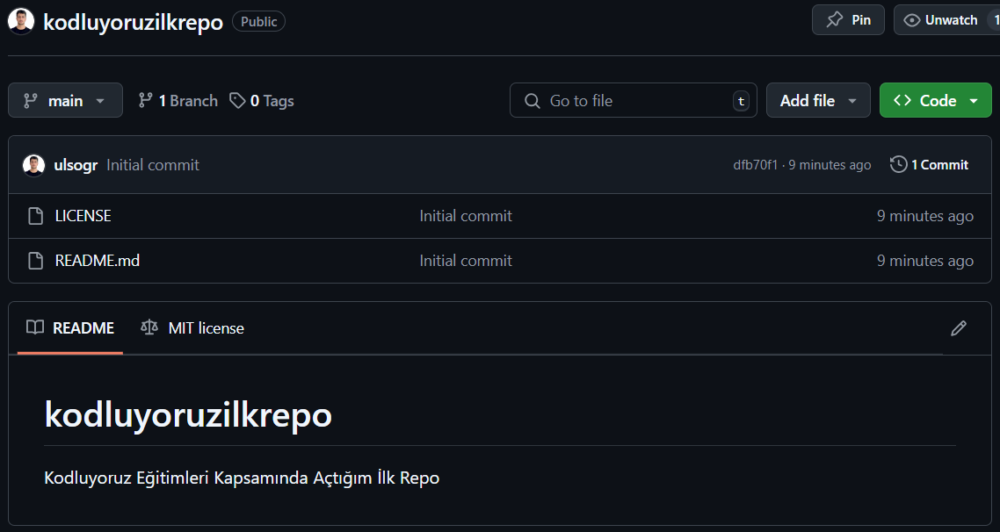

# kodluyoruzilkrepo
Kodluyoruz Eğitimleri Kapsamında Açtığım İlk Repo. İçerisinde bir adet README.md dosyası ve bir adet index.html dosyası barındırıyor. 



## Installation 

Öncelikle projeyi clonelayın. 

```bash
git clone https://github.com/ulsogr/kodluyoruzilkrepo
```

## Usage

Projeyi cloneladıktan sonra Visual Studio Code programında açınız.

Linux için 
```
cd kodluyoruzilkrepo
code . 
```

## Contributing
Pull requestler kabul edilir. Büyük değişiklikler için, lütfen önce neyi değiştirmek istediğinizi tartışmak için bir konu açınız.

## License
[MIT](https://choosealicense.com/licenses/mit/)